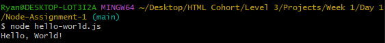

# Node-Assignment-1  

Level 3 Week 1 Day 1 Assignment  

## Objective  

The purpose of this assignment is to establish a foundational understanding of Node.js setup and basic terminal commands. You will install Node.js, verify its installation, and execute a simple "Hello, World!" program. This task aims to introduce you to command-line operations and the importance of Node.js in backend development, as well as to practice documenting and sharing your work through GitHub.  
  
## Instructions  
  
Create a Level 3 Organization within GitHub to store all Level 3 repos(Optional)  
  
### Part 1: Node.js Installation and Verification  
  
#### Install Node.js:  

Download and install the LTS version of Node.js from the official website.  
  
#### Check Node.js and npm Versions:  
  
Open your terminal or Command Prompt.  
Use node -v and npm -v to confirm the versions of Node.js and npm installed on your system.  
- $ node -v  
v20.12.0  
  
- $ npm -v  
10.5.0  
  
### Part 2: GitHub Repository Setup  
  
#### Create a New GitHub Repository:  
  
Name your repository Node-Assignment-1.  
Initialize it with a README.md file.  
  
#### Clone the Repository:  
  
Use the git clone command to clone your repository to your local machine.  
  
### Part 3: Hello World Script  
  
#### Write and Execute the Hello World Program:  
  
Within your cloned repository, create a new file named hello-world.js.  
  
#### Edit hello-world.js in your text editor and enter the following code:  
  
console.log('Hello, World!');  
Save the file and run it by executing node hello-world.js in your terminal.  
Ensure "Hello, World!" is printed in the terminal.  
  
  
  
### Part 4: Documenting Your Work  
  
#### Update the README.md:  
  
Document the steps you took to complete the assignment.  
Include a screenshot of your terminal showing the "Hello, World!" output.  
  
#### Push Your Changes:  
  
Use git add, git commit, and git push commands to push your changes to GitHub.  
  
### Part 5: Submission  
#### Submit Your Assignment:  
  
Provide the URL to your GitHub repository in your submission.
